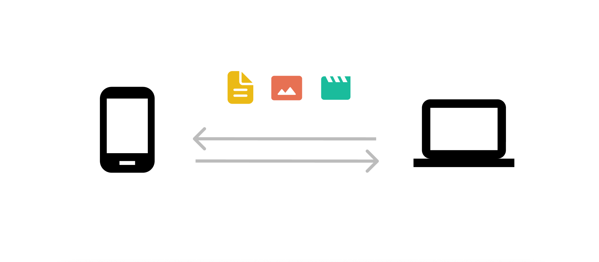

  
  
  
Send picture from android to mac? Large file over 2gb from pc to pc? AirDash handles it all
        securely and free.

        
  

****

## Getting Started

- `npm install`
- `npm run start-web` For web app
- `npm start` For desktop app

## Architecture

AirDash is built with [PeerJS](https://peerjs.com) which sends files through WebRTC. 

The web app is built as a [PWA](https://developers.google.com/web/progressive-web-apps) which enables users to add the on Android and use some native features such as the Android share menu.

The desktop app is built with [electronjs](https://www.electronjs.org).

#### Web architecture

Page load: index.html -> app.js -> registers sw.js service worker

## Deploy and build

- `npm run deploy-web`
- `npm run deploy-desktop`

## PeerJS Server

Uses a custom peerjs server setup at peerjs.flown.io. Its setup with the default suggested "docker run -p 9000:9000 -d peerjs/peerjs-server" together with nginx. 

## Contributing
Pull requests are welcome. Go to [FindCollab](https://findcollabs.com/project/7BK81zF3mZTpT0jjQ2hQ) to see features and improvements in development.
